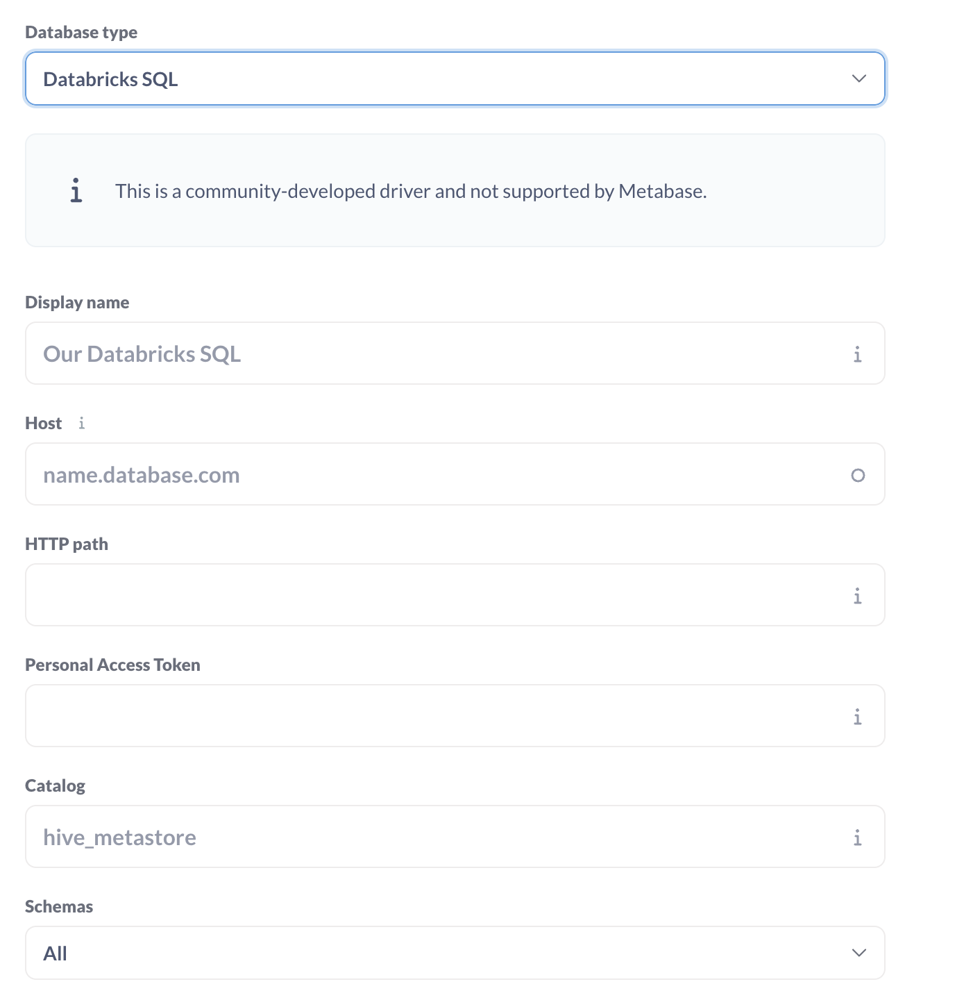

# Metabase Driver: Databricks SQL Warehouse

## Installation

Drivers must be stored in a `plugins` directory in the same directory where `metabase.jar` is, or you can specify the directory by setting the environment variable `MB_PLUGINS_DIR`. There are a few options to get up and running with a custom driver.

You can find jar file on the [release page](https://github.com/schumannc/databricks-sql-driver/releases) or you can build it locally.
## Build

In order to build it locally, you're gonna need [metabase](https://github.com/metabase/metabase) project to build this project, so make sure you clone it in a parent directory. 

```
make build
```

## Run Locally

```
make run
```
Once the Metabase startup completes, you can access your Metabase at `localhost:3000`.

## Usage

Copy `host`, `http-path`, `personal-access-token`, `Catalog` from your Databricks SQL Warehouse page (Connection Details tab) to metabase form.

Since 0.1.0, you don't need to specify the schema/database. Now you can opt between bringing all schemas, just a few named schemas, or all schemas but a selected few.

You can add any supported properties on Additional Options. You can find [supported properties on our guide](https://docs.databricks.com/en/_extras/documents/Databricks-JDBC-Driver-Install-and-Configuration-Guide.pdf). Properties not supported will be attempted to be applied as Spark server-side property.

One example of Spark server-side property is `statement_timeout`. If you add `STATEMENT_TIMEOUT=3600`, for instance, all statements run by metabase in that connection will have a timeout of 3600s. That will not change the default statement timeout of the warehouse nor the workspace.

## Compatibility

Latest version (0.1.0) is compatible with Metabase 0.50 onwards, it is not back compatible with 0.49. For earlier versions check previous releases




